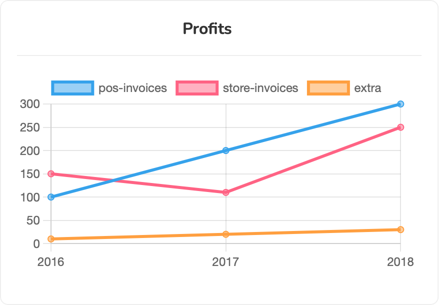
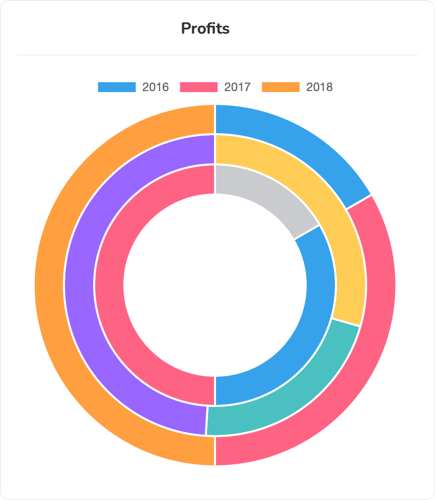
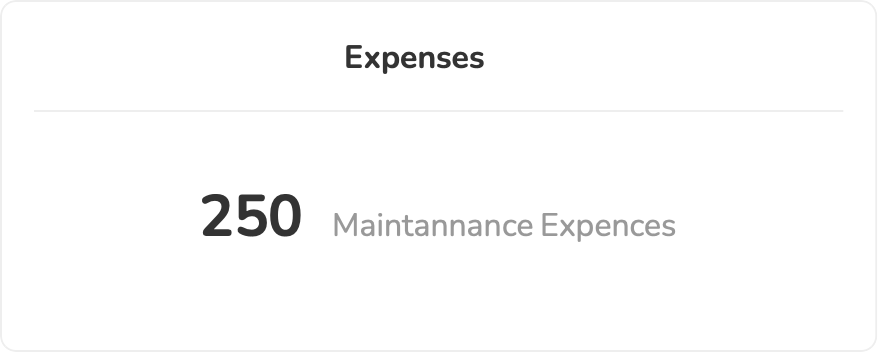

## Fast-Bi


Fast-Bi is a light weight Business Intelligence dashboard manager for all php projects.

### Installation

Install Fast-Bi using composer:

`composer require aldeebhasan/fast-bi`

### Requirements

Fast-Bi require php 8.0 or later versions. it can work on any platform that use php like laravel,codeigniter,symphony
and so on.

## Main features and concepts

Fast-Bi enable you to add different kind of widgets to your dashboard. The main component is  `Widget`, which can
use `Dimension`, `Metric`, or Raw arrays to fully customize the desired widget.

### Dimensions

`Dimension` is a data container that can take any array as input, do some transformation and preparation over it in
order to obtain the desired data. The `Dimension` can be considered as an axis for the charts, column for the table with
predefined functionalities.

Kind of Dimensions:

- dateTime : transform the input to datetime format
- string : transform the input to strings
- number : transform the input to float format
- raw : transform the input to custom format

How to define a new dimension:

```php
use Aldeebhasan\FastBi\Manager\Dimensions;
Dimensions::string('dimension-1',[1,2,4])->build();
Dimensions::number('dimension-2',[1,2,4])->build();
Dimensions::dateTime('dimension-3',['2023-5-5', '2024-6-6'])->build();

// to retrieve the dimension data you can use the `getData()` function.
$dimension = Dimensions::string('dimension-1',[1,2,4])->build();
print($dimension->getData())
//result = ["1","2","4"]//
```

The `dateTime` dimension accept a `format($format)` function to format the resulted data.

example:

```php
$dimension = Dimensions::dateTime('dimension',['2023-5-5', '2024-6-6'])->format('Y-m')->build();
print($dimension->getData())
//result = ["2023-5","2024-6"]//
```

To build your custom dimension you can use the `raw` dimension as follow:
<br/>*Transformer will be applied over each item of the input array*

```php
$dimension = Dimensions::raw('dimension', [1, 2, 3, 4])
            ->setTransformer(fn ($x) => $x - 1)
            ->build();
print($dimension->getData())
//result = [0, 1, 2, 3]//
```

### Metrics

`Metric` is a data container that can take any array as input and do some operation over it in order to obtain the
desired metric. The `Metric` can mainly be used to show some statistics.

Kind of Metrics:

- sum : get the sum of the input data
- max : get the maximum value of the input data
- min : get the minimum value of the input data
- median : get the median value of the input data
- avg : get the average value of the input data
- raw : get custom value of the input data

How to define a new metric:

```php
use Aldeebhasan\FastBi\Manager\Metrics;
Metrics::sum('metric-1',[1,2,3])->build();
Metrics::max('metric-2',[1,2,3])->build();
Metrics::min('metric-3',[1,2,3])->build();
Metrics::median('metric-4',[1,2,3])->build();
Metrics::avg('metric-5',[1,2,3])->build();

// to retrieve the metric data you can use the `getData()` function.
$metric = Metrics::sum('metric-1',[1,2,3])->build();
print($metric->getData())
//result = 6//
```

To build your custom metric you can use the `raw` metric as follow:
<br/>*Transformer will be applied over each item of the input array*

```php
$metric = Metrics::raw('name', [1, 2, 3])
->setMeasure(fn ($data) => count($data))
->build();
print($metric->getData())
//result = 3//
```

### Widgets

The most important component of this package is the `Widgets`. Many type of widgets are predefined for you.

Each `Widget` has three main parts:

- labels : to customize the column name for table or the axis names, ..etc
- dimensions : to define the data you want to show or plot
- metrics : to show some statistics at the bottom of each widget

#### `Table Widgets`

```php
use Aldeebhasan\FastBi\Manager\{Metrics,Dimensions,Widgets};

Widgets::table('users')
        ->labels(['ID', 'Name', 'mobile'])
        ->dimensions([
            Dimensions::number('ids',[1,2,3]),
            'names'=>['Ali', 'Hasan', 'Mohammad'],
            'mobile'=>Dimensions::string('mob',["+01252**","+01252**","+01252**"]),
        ])->metrics([
            Metrics::count('total',[1,2,4]),
            'average'=>Metrics::avg('avg',[1,2,4])
        ])->render()
```


#### `BarChart Widgets`

```php
use Aldeebhasan\FastBi\Manager\{Metrics,Dimensions,Widgets};

Widgets::barChart('profits')
        ->labels(['2016', '2017', '2018'])
        ->dimensions([
            Dimensions::number('pos-invoices',[100,200,300]),
            'store-invoices'=>[150,110,250],
            Dimensions::number('extra',[10,20,30]),
        ])->metrics([
            Metrics::sum('total',[100,200,300]),
            'max-income'=>Metrics::max('avg',[100,200,300]),
            'min-income'=>Metrics::min('avg',[100,200,300])
        ])->render()
        
//To make the bar chart horizontal, you can just add the following settings to the widget:
Widgets::barChart('profits')
        ->labels(['2016', '2017', '2018'])
        ->settings(['direction'=>'y'])   //// make the y axis as the base
        ->dimensions([
            Dimensions::number('pos-invoices',[100,200,300]),
            'store-invoices'=>[150,110,250],
            Dimensions::number('extra',[10,20,30]),
        ])->metrics([
            Metrics::sum('total',[100,200,300]),
            'max-income'=>Metrics::max('avg',[100,200,300]),
            'min-income'=>Metrics::min('avg',[100,200,300])
        ])->render()
```

| Vertical(default)  | Horizontal |
| ------------- | ------------- |
|  |    |

#### `LineChart Widgets`

```php
use Aldeebhasan\FastBi\Manager\{Metrics,Dimensions,Widgets};

Widgets::lineChart('profits')
        ->labels(['2016', '2017', '2018'])
        ->dimensions([
            Dimensions::number('pos-invoices',[100,200,300]),
            'store-invoices'=>[150,110,250],
            Dimensions::number('extra',[10,20,30]),
        ])->metrics([
            Metrics::sum('total',[100,200,300]),
            'max-income'=>Metrics::max('avg',[100,200,300]),
            'min-income'=>Metrics::min('avg',[100,200,300])
        ])->render()
```



#### `pieChart Widgets`

```php
use Aldeebhasan\FastBi\Manager\{Metrics,Dimensions,Widgets};

Widgets::pieChart('profits')
        ->labels(['2016', '2017', '2018'])
        ->dimensions([
            Dimensions::number('pos-invoices',[100,200,300]),
            'store-invoices'=>[150,110,250],
            Dimensions::number('extra',[10,20,30]),
        ])->render()

 Widgets::pieChart('profits of pos')
        ->labels(['2016', '2017', '2018'])
        ->dimensions([
            Dimensions::number('pos-invoices',[100,200,300]),
        ])->render()
```

| Overall  | For Pos |
| ------------- | ------------- |
|  |    |

#### `pieChart Widgets`

```php
use Aldeebhasan\FastBi\Manager\{Metrics,Dimensions,Widgets};

Widgets::doughnutChart('profits')
        ->labels(['2016', '2017', '2018'])
        ->dimensions([
            Dimensions::number('pos-invoices',[100,200,300]),
            'store-invoices'=>[150,110,250],
            Dimensions::number('extra',[10,20,30]),
        ])->render()

 Widgets::doughnutChart('profits of pos')
        ->labels(['2016', '2017', '2018'])
        ->dimensions([
            Dimensions::number('pos-invoices',[100,200,300]),
        ])->render()
```

| Overall  | For Pos |
| ------------- | ------------- |
|  |    |

#### `scatterChart Widgets` & `bubbleChart Widgets`

These two chart are very similar to each other. The main difference is that the bubble chart will have a different
radius for each data point.

The default behaviour of these two charts is to make the first dimension is the base dimension which will be combined
with all the other dimensions.

<b>In the following example `pos-invoices` will be combined with `store-invoices` and then with `extra` accordingly </b>

If the labels are not defined, the package will combine the dimensions names to make a suitable naming for each dataset.

```php
use Aldeebhasan\FastBi\Manager\{Metrics,Dimensions,Widgets};

Widgets::scatterChart('profits')
        ->labels(['POS To Store','POS to Extra'])
        ->dimensions([
            Dimensions::number('pos-invoices',[100,110,120,130,140,160,200,250]),
            Dimensions::number('store-invoices',[100,200,300,210,300,400,450,600]),
            Dimensions::number('extra',[10,20,30,80,90,150,200,250]),
        ])->render()

Widgets::bubbleChart('bubbles profits')
        ->labels(['POS To Store','POS to Extra'])
        ->dimensions([
            Dimensions::number('pos-invoices',[100,110,120,130,140,160,200,250]),
            Dimensions::number('store-invoices',[100,200,300,210,300,400,450,600]),
            Dimensions::number('extra',[10,20,30,80,90,150,200,250]),
        ])->render()
```

| Scatter chart | Bubble chart  |
| ------------- | ------------- |
|  |    |

#### `polarAreaChart Widgets`

```php
use Aldeebhasan\FastBi\Manager\{Metrics,Dimensions,Widgets};
//single dimension
Widgets::polarAreaChart('polar profits')
        ->labels(['2016 ','2017','2018'])
        ->dimensions([
            Dimensions::number('pos-invoices',[100,110,120]),
        ])->render()
//multi dimensions
Widgets::polarAreaChart('polar profits (multi)')
         ->labels(['2016 ','2017','2018'])
        ->dimensions([
            Dimensions::number('pos-invoices',[125,110,120]),
            Dimensions::number('store-invoices',[100,150,175]),
            Dimensions::number('extra',[150,110,150]),
        ])->render()

```

| Single Dimension | Multi Dimensions
| ------------- | ------------- 
|  | 

#### `radarChart Widgets`

```php
use Aldeebhasan\FastBi\Manager\{Metrics,Dimensions,Widgets};

//single dimension
 Widgets::radarChart('radar profits')
         ->labels(['2016 ','2017','2018','2019',2020])
        ->dimensions([
            Dimensions::number('pos-invoices',[125,150,180,190,200]),
        ])->render()
//multi dimensions
Widgets::radarChart('radar profits (multi)')
         ->labels(['2016 ','2017','2018'])
        ->dimensions([
            Dimensions::number('pos-invoices',[125,110,120]),
            Dimensions::number('store-invoices',[100,150,175]),
            Dimensions::number('extra',[150,110,150]),
        ])->render()
```

| Single Dimension | Multi Dimensions
| ------------- | ------------- 
|  | 

#### `number Widgets`

This widget is used to represent some statistic related to your dashboard.

```php
use Aldeebhasan\FastBi\Manager\{Metrics,Dimensions,Widgets};

//single dimension
 Widgets::number('expenses')
        ->labels(['Maintenance Expenses'])
        ->dimensions([
            Dimensions::number('maintainance',[250]),
        ])->render()
//multi dimensions
Widgets::number('incomes')
        ->dimensions([
             Dimensions::number('orders',[100000]),
             Dimensions::number('marketing',[1500]),
            'social-media' => 6000
        ])->render()
```

| Single        | Multi
| ------------- | ------------- 
|  | 

#### `progressBar Widgets`

This widget is used to represent some statistic related to your dashboard.
<b>For this widget, you should specify numbers in term of percentage (max is 100 and min 0)</b>

```php
use Aldeebhasan\FastBi\Manager\{Metrics,Dimensions,Widgets};

//single dimension
 Widgets::progressBar('expenses')
        ->labels(['Maintenance Expenses'])
        ->dimensions([
            Dimensions::number('maintainance',[250]),
        ])->render()
//multi dimensions
Widgets::progressBar('incomes')
        ->dimensions([
             Dimensions::number('orders',[100000]),
             Dimensions::number('marketing',[1500]),
            'social-media' => 6000
        ])->render()
```

| Single        | Multi
| ------------- | ------------- 
|  | 

#### `geoMap Widgets`

For this widget you need to specify the countries you want to show the statistics on. You can define the country using
the iso2 code.

```php
use Aldeebhasan\FastBi\Manager\{Metrics,Dimensions,Widgets};

//single dimension
 Widgets::geoMap('map')
        ->countries(['US','CA','FR','CN'])
         ->labels(['Population','Square Area'])
        ->dimensions([
            Dimensions::number('population',['150','200','300','400']),
            'area'=>['1500','2000','3000','6000'],
        ])->render()

```

  


## License

Fast-Bi package is licensed under [The MIT License (MIT)](https://github.com/git/git-scm.com/blob/main/MIT-LICENSE.txt).

## Security contact information

To report a security vulnerability, contact directly to the developer contact email [Here](mailto:aldeeb.91@gmail.com).
